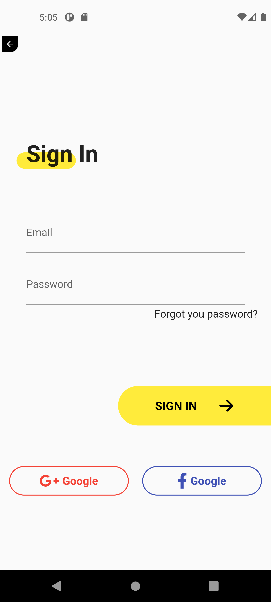

# Flutter UI Challenges

Check it out.

Flutter project with UI challenges without third-party widgets packages

# Pages

# Apps clone

# Ideas inspiration from
* https://github.com/lohanidamodar/flutter_ui_challenges/blob/master/screenshots/
* https://www.uplabs.com/
* https://dribbble.com

# Assets
https://www.svgrepo.com/collection/food-and-drinks-flat-icons/
https://undraw.co/illustrations

# Packages used
* font_awesome_flutter
* flutter_svg
* get
* google_fonts
* provider
* url_launcher
